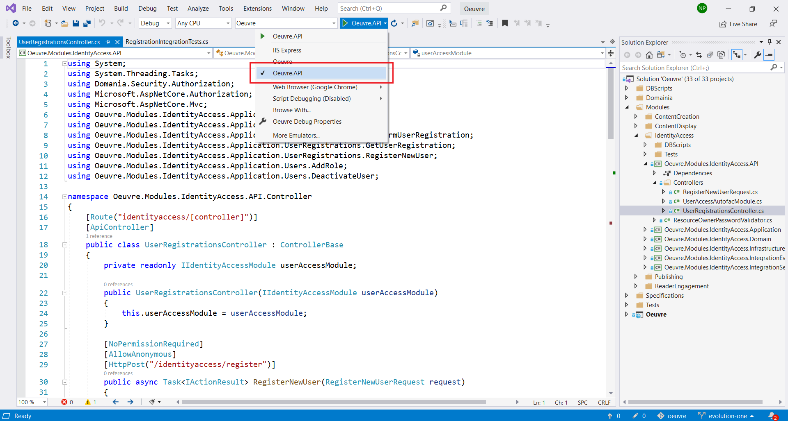
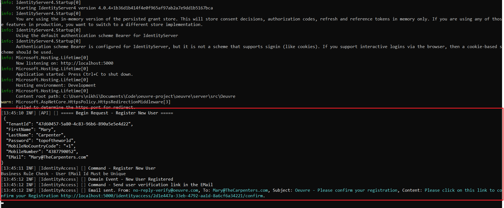

# Setup Instructions

### Table of Contents

[1. Clone the Repository](#Clone-the-Repository)

[2. Setting-up the Database](#Setting-up-the-Database)

&nbsp;&nbsp;[2.1 Enable Running Scripts in Console](#Enable-Running-Scripts-in-Console)

&nbsp;&nbsp;[2.2 Creating the DB](#Creating-the-DB)

[3. Setting-up and Running the Project](#Setting-up-and-Running-the-Project)

[4. Request Flow Tracing](#Request-Flow-Tracing)

[5. Application Resources](Application-Resources)

&nbsp;&nbsp;[7.1 Logs](#Logs) 

&nbsp;&nbsp;[7.2 EMails](#EMails)


### Clone the Repository

  ```
  git clone https://github.com/codefinity/oeuvre.git
  ```

### Setting-up the Database

1. Install [SQL Server Developer Edition](https://www.microsoft.com/en-gb/sql-server/sql-server-downloads)

2. Install [SQL Server Management Studio](https://docs.microsoft.com/en-us/sql/ssms/download-sql-server-management-studio-ssms?view=sql-server-ver15)

#### Enable Running Scripts in Console

1. Open SQL Server Management Studio.

2. Go to -> Tools > Options > Query Execution > SQL Server > General 

3. Ensure this is checked -> "By default, open new queries in SQLCMD mode"

#### Creating the DB

In the windows console go to this location -> "oeuvre\server\src\DBScripts" and run the batch file

  ```
  C:\...oeuvre\server\src\DBScripts>oeuvre-recreate-dev-db-tables-with-test-and-seed-data.bat
  ```

### Setting-up and Running the Project

1. Install [.Net Core 3.1 LTS](https://dotnet.microsoft.com/download/dotnet-core/3.1)

2. Install [Visual Studio](https://visualstudio.microsoft.com/)  

3. Install [SpecFlow for Visual Studio 2019](https://marketplace.visualstudio.com/items?itemName=TechTalkSpecFlowTeam.SpecFlowForVisualStudio)

4. Open the project in Visual Studio.

5. Select "Oeuvre.API" from Run Dropdown and then Click on Run




### Request Flow Tracing

Flow of each request can be followed on the console window. Observe how it goes from one component to another, and corellate it with the Event-Storming flow. The messages are logged manually as of now. Will be done automatically using AOP in future.

This is the example for request flow tracing for the Registration feature.




### Application Resources

#### Logs

Logs are stored in the following locations in their respective modules folder.

  ```
  C:\Users\<Windows-Account>\OeuvreLogs
  ```
  

#### EMails

EMails for Dev Environment go into this folder.

  ```
  C:\Users\<Windows-Account>\OeuvreDevMails
  ```
